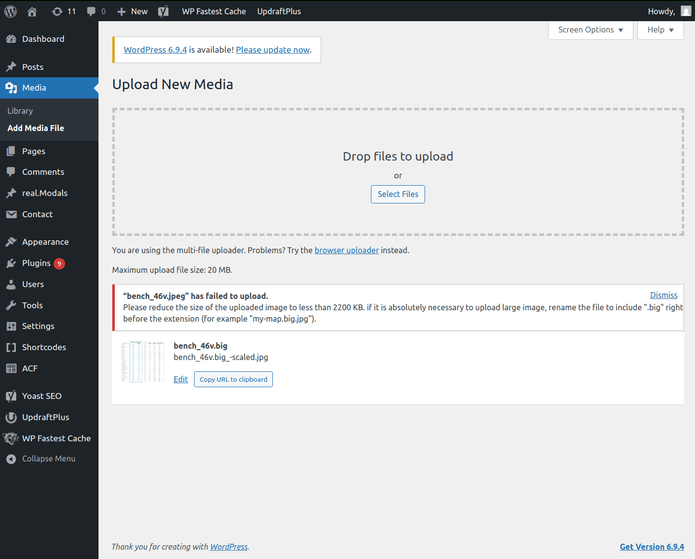
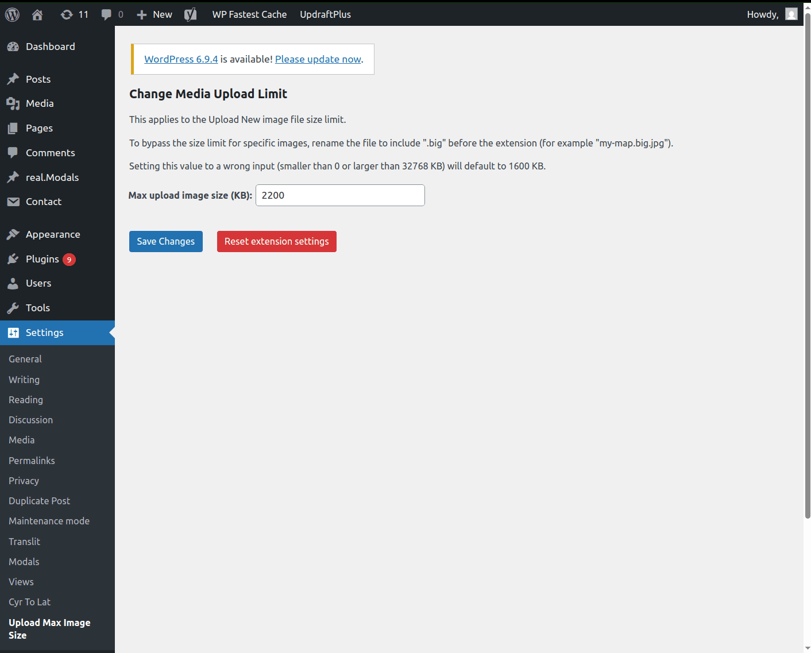

# Upload Max Image Size WordPress Plugin

<table>
	<tr>
		<td style="padding-right: 24px;">
			
		</td>
		<td style="padding-left: 24px;">
			
		</td>
	</tr>
</table>

A simple WordPress plugin which limits the image upload size.

Forked from [TiffanyE94/MediaUploadLimit at a29cd6b5ce22e656ef32aad6c765c3ed507d9f5b](https://github.com/TiffanyE94/MediaUploadLimit/tree/a29cd6b5ce22e656ef32aad6c765c3ed507d9f5b).

Used code from [WP-Max-Upload-Limiter](https://github.com/iPublicis/WP-Max-Upload-Limiter) by [iPublicis](https://github.com/iPublicis).

## Features

- Configurable limit at `/wp-admin/options-general.php?page=UploadMaxImageSize`
- To bypass the size limit for specific images, rename the file to include `.big` before the extension (for example `my-map.big.jpg`).

## Installation

To install copy files from `src/` directory to new `wp-content/plugins/upload-max-image-size/` directory of your WordPress site. Activate the plugin.

## Development

### Translation

```
wp i18n make-pot wp-content/plugins/upload-max-image-size
msgfmt -o upload-max-image-size-ru_RU.mo upload-max-image-size-ru_RU.po
```
